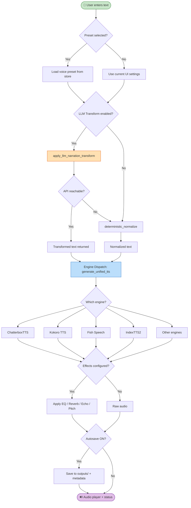
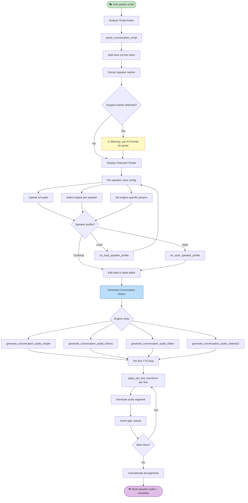
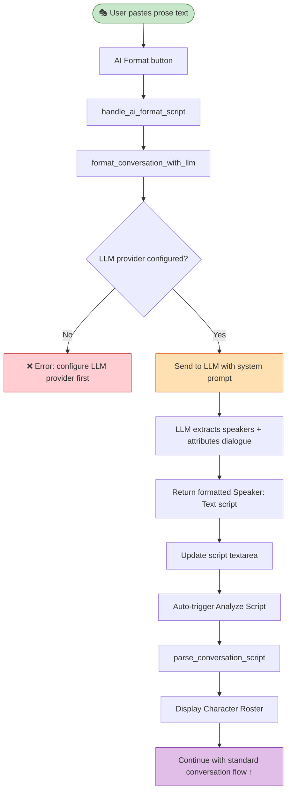
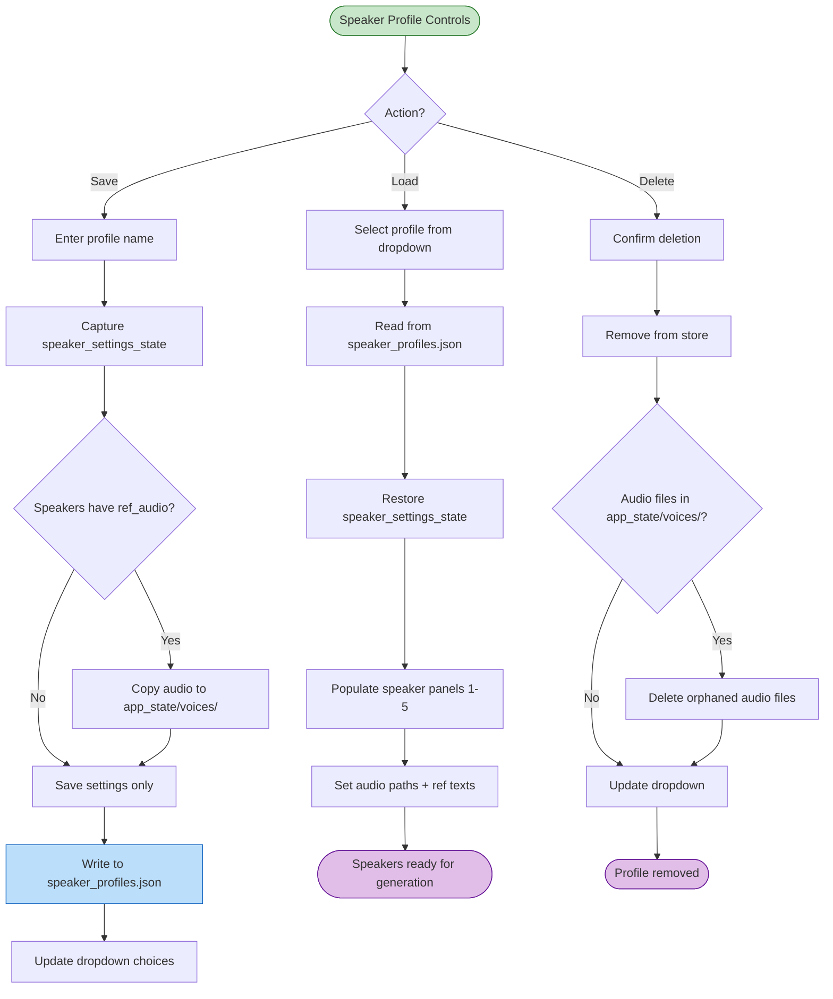
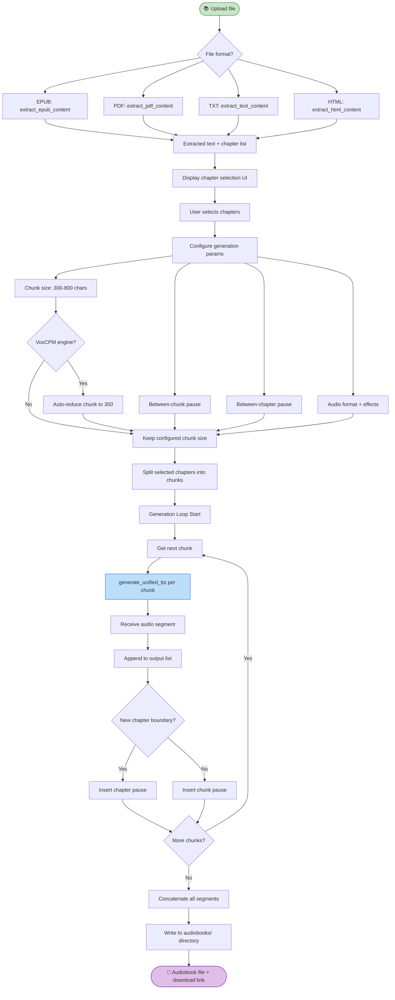
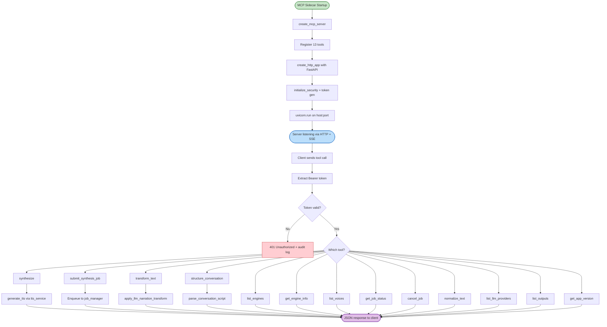
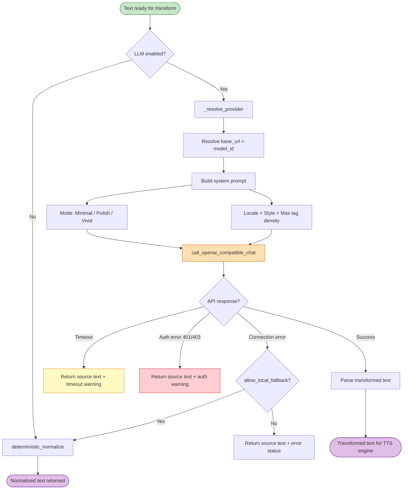
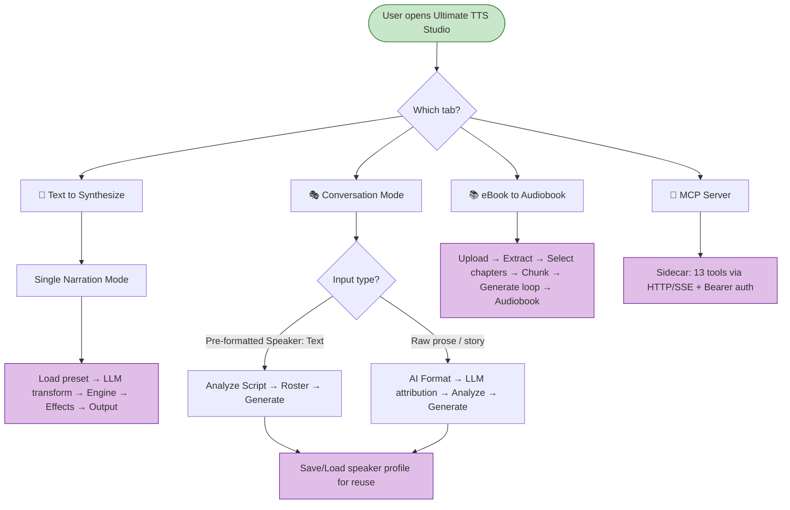

# Workflow Recipes — Ultimate TTS Studio SUP3R Edition

**Ten step-by-step recipes for the most common real-world tasks.**

Each workflow here is self-contained. Jump straight to the one you need — you don't have to read the
others first. If a step mentions a feature in depth, the [User Guide](USER_GUIDE.md) has the full
explanation.

> 💡 **Before starting any workflow:** Open **Model Management**, find the engine you're using, and
> click **Load**. Wait for the green status badge before you generate anything. All workflows assume
> this step is complete.

---

## Contents

1. [Clone My Voice and Read Text](#1-clone-my-voice-and-read-text)
2. [Create a Podcast Episode](#2-create-a-podcast-episode)
3. [Convert My eBook to Audiobook](#3-convert-my-ebook-to-audiobook)
4. [Polish Raw Text for Professional Narration](#4-polish-raw-text-for-professional-narration)
5. [Design a Custom Voice from Scratch](#5-design-a-custom-voice-from-scratch)
6. [Add Professional Audio Effects](#6-add-professional-audio-effects)
7. [Generate Multi-Language Content](#7-generate-multi-language-content)
8. [Use TTS Studio from Your Code Editor](#8-use-tts-studio-from-your-code-editor)
9. [Save and Reuse Voice Presets](#9-save-and-reuse-voice-presets)
10. [Batch Generate with Consistent Settings](#10-batch-generate-with-consistent-settings)

**Technical Diagrams**

- [Single Narration Mode](#single-narration-mode-diagram)
- [Conversation Mode — Pre-Formatted Script](#conversation-mode--pre-formatted-script)
- [Conversation Mode — AI Format (Prose)](#conversation-mode--ai-format-prose)
- [Speaker Profile Management](#speaker-profile-management)
- [eBook Audiobook Mode](#ebook-audiobook-mode-diagram)
- [MCP Server Mode](#mcp-server-mode-diagram)
- [LLM Narration Transform Pipeline](#llm-narration-transform-pipeline)
- [Master Mode Decision Tree](#master-mode-decision-tree)

---

## 1. Clone My Voice and Read Text

**What you'll accomplish:** Record or provide a short audio clip of any voice, and generate new
speech in that voice reading any text you choose. This is the fastest path to a personalized, cloned
voice.

**Best engine for this workflow:** 🎤 ChatterboxTTS — the most beginner-friendly voice cloning path,
with automatic model download and clean results from short clips.

**Time estimate:** 10–15 minutes on your first run; under 3 minutes on subsequent runs.

<!-- screenshot: 🎤 ChatterboxTTS loaded in Model Management with green status badge -->

### Steps

**1. Prepare your reference audio.**

Record yourself (or use an existing recording) speaking naturally for 5–30 seconds. A few practical
requirements:

- Clean audio — no background music, AC hum, or crowd noise
- Natural, conversational pace — not rushed, not theatrical
- WAV or MP3 format

A phone recording in a quiet room works fine. Professional studio quality is better but not
required. The clip is used to capture the voice's unique characteristics — tone, pace, and timbre —
so what matters most is that it's clear.

> ⚠️ **Ethics reminder:** Only clone voices you have permission to use. Cloning someone else's voice
> without consent is unethical and potentially illegal in many jurisdictions.

**2. Load the engine.**

In the **Model Management** accordion, find **🎤 ChatterboxTTS** and click **Load**. If this is your
first time, the model downloads automatically — give it a minute. When the status badge turns green,
continue.

**3. Select the engine.**

Open the **Engine Selection** accordion. Choose **🎤 ChatterboxTTS** from the dropdown. The **Engine
Settings** panel updates to show ChatterboxTTS controls.

<!-- screenshot: Engine Selection with ChatterboxTTS selected, and Engine Settings showing reference audio upload and Exaggeration/Temperature controls -->

**4. Upload your reference audio.**

In **Engine Settings**, find the **Reference Audio** upload field. Upload your prepared clip. You
can also add a **Reference Text** transcription of what's spoken in the clip — this helps the engine
calibrate the voice more accurately, but it's optional.

**5. Type your text.**

Click the **📝 TEXT TO SYNTHESIZE** tab and type or paste whatever you want generated. Keep your
first test under 200 characters so you can evaluate quality quickly.

**6. Generate.**

Click **Generate**. The right column shows progress while the model processes your text. Generation
typically takes 10–30 seconds depending on text length and GPU speed.

**7. Listen and evaluate.**

Play the result in the audio player. Your generated audio is saved automatically to the `outputs/`
folder.

<!-- screenshot: Right column showing the audio player with generated ChatterboxTTS output -->

### Expected Outcome

Audio that sounds like the person from your reference clip, reading your text. The more natural and
clean your reference audio, the closer the match.

### Tips

- **Quality of the reference clip matters more than its length.** A clean 10-second clip beats a
  noisy 30-second one.
- **Exaggeration slider:** Start at the default (0.5). Move it up for a more dramatic delivery, down
  for a flatter, more controlled read.
- **Not happy with the result?** Try a different recording of the same voice — even the same words
  recorded twice can yield notably different results.

### Common Mistakes to Avoid

- Uploading reference audio with background music or reverb from a large room
- Using an extremely short clip (under 3 seconds) — the engine needs enough to generalize

---

## 2. Create a Podcast Episode

**What you'll accomplish:** Turn a two- (or three-) person dialogue script into a complete podcast
episode with distinct voices for each speaker, controlled pacing, and a single exportable audio
file.

**Best engine for this workflow:** 🗣️ Kokoro TTS for pre-built voices (fast, no reference audio
needed), or 🎤 ChatterboxTTS if you want to use real cloned voices.

**Time estimate:** 15–25 minutes including script preparation.

<!-- screenshot: 🎭 CONVERSATION MODE tab with a script pasted into the input area -->

### Steps

**1. Write or paste your dialogue.**

Click the **🎭 CONVERSATION MODE** tab. Your script needs one line per spoken segment in
`Speaker: Text` format:

```text
Alex: So let's talk about what happened this week.
Jordan: I've been waiting for this. Where do we even start?
Alex: At the beginning, I suppose. The announcement caught everyone off guard.
Jordan: Completely. Nobody saw it coming.
```

Up to five distinct speakers are supported.

> **Don't have a script in this format?** Paste your raw dialogue and click **AI Format**. The
> connected LLM will restructure it into the correct `Speaker: Text` layout automatically. (Requires
> an LLM provider configured in AI Script Polish — see
> [Section 5 of the User Guide](USER_GUIDE.md#5-ai-script-polish) if you haven't set one up.)

**2. Analyze the script.**

Click **Analyze Script**. The app reads your dialogue and builds a character roster — one row per
speaker. This is where you'll assign each host their voice.

<!-- screenshot: Character roster showing two speakers with voice assignment dropdowns and engine selection -->

**3. Load your engines.**

Before assigning voices, make sure the engine(s) you plan to use are loaded. Open **Model
Management**, find your chosen engine, and click **Load**. For a two-host podcast using Kokoro: load
Kokoro once, and both speakers can use different voices from the same engine.

**4. Assign voices to each speaker.**

In the character roster, each speaker has its own row with an engine dropdown and a voice selector:

- For **🗣️ Kokoro TTS**: choose any voice from the built-in dropdown. Popular pairings for a podcast
  feel: `am_michael` and `af_heart` for a male/female co-host setup.
- For **🎤 ChatterboxTTS**: upload a separate reference audio clip for each speaker.

Both speakers can use the same engine with different voice settings, or different engines entirely.

**5. Set timing controls.**

Scroll to the timing sliders:

- **Speaker Change Pause:** Set to 1.0–1.2 seconds for natural podcast pacing. This is the gap
  between different hosts speaking.
- **Same Speaker Pause:** Leave at default (0.3 seconds) unless your script has a speaker delivering
  multiple consecutive lines.

**6. (Optional) Refine individual lines.**

The **Line Editor** panel shows every line in a table. If a specific line needs a phrasing tweak,
edit the text directly here without changing the rest of the script.

**7. Generate.**

Click **Generate Conversation**. The app processes each line in sequence with your configured voices
and pauses, then combines everything into a single audio file.

<!-- screenshot: Right column showing completed conversation audio in the player with total duration visible -->

**8. Review and export.**

Play the full episode in the audio player. The file is saved to `outputs/`. Download it from the
right column for editing or distribution.

### Expected Outcome

A single audio file with two distinct voices trading lines at natural podcast pacing. Each speaker
consistently uses the voice you assigned throughout.

### Tips

- Keep scripts under 2,000 words per generation for best quality and predictable generation time.
- For a show intro + outro, generate those separately, then combine in an audio editor.
- For greater voice contrast, try pairing two very different Kokoro voices, or mix Kokoro for one
  host with ChatterboxTTS (reference audio) for the other.

### Common Mistakes to Avoid

- Forgetting to load an engine before assigning it to a speaker — the roster lets you assign, but
  generation will fail if the engine isn't loaded
- Not clicking **Analyze Script** after editing your script — the roster won't update otherwise

---

## 3. Convert My eBook to Audiobook

**What you'll accomplish:** Upload an eBook file and convert selected chapters into narrated audio,
automatically chunked and stitched together with proper chapter pacing.

**Best engine for this workflow:** 🗣️ Kokoro TTS or 🐟 Fish Speech. Both handle long-form content
well. Kokoro auto-downloads; Fish Speech requires a manual download from the **Model Management**
accordion but delivers the most natural-sounding prosody for extended narration.

**Time estimate:** 5 minutes setup + generation time (varies by chapter length and engine speed).

<!-- screenshot: 📚 EBOOK TO AUDIOBOOK tab with file upload area -->

### Steps

**1. Load your engine.**

Go to **Model Management** and load your chosen engine. For Fish Speech, click the **Download**
button inside its Model Management section first, then **Load** after the download completes.

**2. Upload your eBook.**

Click the **📚 EBOOK TO AUDIOBOOK** tab. Drag your file onto the upload area or click to browse.
Supported formats: `.epub`, `.pdf`, `.txt`, `.html`, `.htm`, `.rtf`, `.fb2`, `.odt`.

> 💡 **Tip:** Use `.epub` when you have the option. EPUB files carry clean chapter metadata, giving
> the app reliable structure to work with. PDFs vary widely in how well their text extracts.

The app analyzes the file immediately and shows a list of detected chapters.

<!-- screenshot: Chapter selection list showing detected chapters with checkboxes after file upload -->

**3. Select chapters.**

Check the chapters you want to convert. Click **Select All** to queue the full book, or hand-pick
individual chapters. For a test run, select a single short chapter first.

**4. Choose your audio format.**

Pick **WAV** for uncompressed quality (larger files, best for editing afterward), or **MP3** for
smaller files that work everywhere.

**5. Configure chunking.**

The **Text Chunk Length** slider (range: 300–800 characters, default: 500) controls how the app
breaks text before sending it to the engine. TTS engines work best on short, self-contained
passages. The defaults work well for most books. If you notice quality dipping on longer sentences,
reduce chunk size to 350–400.

**6. Set timing gaps.**

- **Between chunks:** 0.5 seconds is a natural pause between sentences. Increase to 1.0 second if
  you want more breathing room.
- **Between chapters:** 2–3 seconds gives a clear chapter-break feeling without being awkward.

**7. Generate.**

Click **Generate Audiobook**. A progress indicator shows which chapter and chunk is currently being
processed. For a full book, this may take a while — generation is proportional to text length and
engine speed.

<!-- screenshot: Audiobook generation in progress with chapter and chunk progress shown -->

**8. Access your output.**

Files under 50 MB or 30 minutes play directly in the interface when complete. Larger files are saved
to the `audiobooks/` folder and a download link appears in the right column.

### Expected Outcome

Individual audio files per chapter (or a combined file, depending on settings), ready to load into
any audio player or editor.

### Tips

- Generate one short chapter first to confirm the voice sounds right before committing to a full
  book.
- Fish Speech can produce audio that is louder than other engines — start your system volume at 50%
  when previewing Fish Speech output.
- Once happy with the result, save your engine/voice configuration as a preset (see
  [Workflow 9](#9-save-and-reuse-voice-presets)) so you can pick up exactly where you left off.

### Common Mistakes to Avoid

- Not downloading the Fish Speech model before clicking Load — the Load button will appear to work
  but the engine won't generate correctly
- Using very large chunk sizes (700–800) for dense, complex prose — shorter chunks handle intricate
  sentence structures more reliably

---

## 4. Polish Raw Text for Professional Narration

**What you'll accomplish:** Take a rough piece of text — blog post, notes, bullet points — and use
AI Script Polish to transform it into professionally paced narration-ready prose, then generate
speech with a high-quality engine.

**Best engine for this workflow:** 🎵 F5-TTS, 🎤 ChatterboxTTS, or 🐟 Fish Speech. All produce
natural-sounding output well-suited to professional narration.

**Time estimate:** 5–10 minutes.

<!-- screenshot: 📝 TEXT TO SYNTHESIZE tab with the Narration Transform accordion expanded below the text area -->

### Steps

**1. Paste your raw text.**

Click the **📝 TEXT TO SYNTHESIZE** tab and paste your source material. It doesn't need to be
polished — that's the point. Something like:

> _"Updated Q3 results: revenue up 14% vs prior year. Key drivers: new product line (up 40%), EMEA
> expansion, cost reductions. Next steps: review by CFO, finalize investor brief for Oct 15th."_

**2. Open AI Script Polish.**

In the **📝 TEXT TO SYNTHESIZE** tab, expand the **Narration Transform** accordion. This is the AI
Script Polish panel.

> **Terminology note:** The panel label in the UI reads "Narration Transform" — throughout this
> guide, we call it AI Script Polish to describe what it actually does.

**3. Connect your LLM provider.**

Select a provider from the **Provider** dropdown. For local use with no API key: choose **Ollama**
or **LM Studio** (requires either to be running on your machine). For cloud: choose **GitHub
Models** (free tier, requires a GitHub token) or **Google Gemini API**.

Enter your API key if required, select a model, and click **🔗 Test Connection**. A green
confirmation tells you the connection is live.

<!-- screenshot: Narration Transform accordion showing provider dropdown, API key field, and Test Connection button with green status -->

**4. Choose Vivid mode for narration.**

Set **Transform Mode** to **Vivid**. For a professional narration style, set **Style** to
**Professional/Formal** or **Storytelling/Cinematic** depending on your content.

> **Mode guide in brief:**
>
> - **Minimal** — expands numbers and abbreviations only. No rewrites.
> - **Polish** — smooths phrasing, adds natural transitions.
> - **Vivid** — adds dramatic pacing, emotional beats, breathing cues. Best for narration.

**5. Apply the transform.**

Click **Apply Transform**. The text area updates with your rewritten text. The raw notes from above
might become:

> _"Updated third-quarter results are in — and the news is strong. Revenue is up fourteen percent
> compared to the prior year. The biggest driver? A new product line that surged forty percent above
> projection. Combined with our ongoing expansion into EMEA and meaningful cost reductions, the
> numbers paint a compelling picture. Next on the agenda: the CFO review, followed by finalizing the
> investor brief ahead of the October fifteenth deadline."_

**6. Review and adjust.**

Read through the transformed text. Make any manual tweaks — AI transforms are a strong starting
point, not a final draft. Fix anything that sounds off.

**7. Generate.**

Load your engine (🎵 F5-TTS or your preference), select it in **Engine Selection**, and click
**Generate**.

<!-- screenshot: Right column showing completed audio for the polished narration text -->

### Expected Outcome

A narrated audio file where numbers are spoken correctly, sentence flow is natural, and the pacing
feels professional — not like a robot reading spreadsheet notes.

### Tips

- Set the **Locale** dropdown to match your audience — US English, British English, Australian
  English, etc. — so numbers, dates, and spelling conventions are handled correctly.
- **Minimal mode is underrated.** Even if you don't want creative rewrites, Minimal mode alone
  catches enough formatting issues to noticeably improve the output.

### Common Mistakes to Avoid

- Clicking Generate before Apply Transform — the engine sees your original raw text, not the
  polished version
- Using Vivid mode for dry technical or data-heavy content — it adds dramatic language that can feel
  jarring when the source material is factual

---

## 5. Design a Custom Voice from Scratch

**What you'll accomplish:** Create a completely new voice using only a text description — no
recording, no reference audio. Describe the voice you want, and the engine generates it.

**Engine for this workflow:** 🎨 Qwen Voice Design — the only engine in the suite that creates
voices from descriptions rather than recordings.

**Time estimate:** 10–20 minutes to design and refine a voice you're happy with.

<!-- screenshot: Engine Selection with 🎨 Qwen Voice Design selected -->

### Steps

**1. Load the Qwen model.**

Go to **Model Management** and load the Qwen model. One model powers all three Qwen modes (Voice
Design, Voice Clone, and Custom Voice). Load it once and all three are ready.

**2. Select the engine.**

Open the **Engine Selection** accordion and choose **🎨 Qwen Voice Design** from the dropdown. The
**Engine Settings** panel updates to show a **Voice Description** text field.

**3. Write your voice description.**

In the **Voice Description** field, describe the voice you want. Be specific about:

- **Gender and age:** "A middle-aged woman" / "An older man in his sixties"
- **Tone and character:** "Warm, friendly, authoritative" / "Energetic and enthusiastic"
- **Pace and delivery style:** "Measured and deliberate" / "Conversational and light"
- **Any additional quality:** "Slightly husky" / "Clear and well-articulated"

Example description:

> _"A calm, professional male narrator in his forties. Deep, resonant voice with a measured pace.
> Clear enunciation, no accent. Suitable for documentary narration."_

**4. Type a test sentence.**

Click the **📝 TEXT TO SYNTHESIZE** tab and type a short passage that would let you evaluate the
voice well. Something with varied sentence structure works better than a single flat sentence:

> _"Welcome. Today, we explore something remarkable — a story told not in pictures, but in sound."_

**5. Generate a sample.**

Click **Generate**. The engine interprets your description and generates a voice to match.

<!-- screenshot: Right column showing audio player after Qwen Voice Design generation, with the voice description visible in Engine Settings -->

**6. Listen and refine.**

Play the result. Does it match what you imagined? Adjust your description and generate again:

- Too young-sounding → add "mature" or specify an older age range
- Too robotic → add "natural, conversational delivery"
- Missing a specific quality → describe it more explicitly

Iterate until the voice feels right. Three to five generations is a typical refinement cycle.

**7. Save the configuration.**

Once you're happy, save your engine + description as a named preset using **🧭 Workspace Controls**
(see [Workflow 9](#9-save-and-reuse-voice-presets)). This lets you recall the exact voice for future
projects without re-describing it.

### Expected Outcome

A voice that matches your description, ready for production use — no recording sessions, no waiting
for voice actors.

### Tips

- Qwen Voice Design works best when descriptions are specific. "A friendly voice" produces
  inconsistent results; "A warm, friendly female voice in her thirties, upbeat but measured" gives
  the engine much more to work with.
- Qwen Voice Design generation is slower than other engines — this is normal.

### Common Mistakes to Avoid

- Giving vague one-word descriptions — the more specific the description, the better the match
- Switching to a different Qwen mode mid-workflow without reloading — all three Qwen modes share one
  model, so switching is instant, but make sure you're selecting the correct mode in the Engine
  dropdown

---

## 6. Add Professional Audio Effects

**What you'll accomplish:** Take a piece of generated audio and add post-processing effects to give
it the polished sound of a professional studio recording.

**When to use this:** After generating any audio with any engine. Effects are applied to the next
generation — so configure them before clicking Generate, or regenerate after adjusting.

**Time estimate:** 5 minutes to configure; effects apply automatically on the next Generate.

<!-- screenshot: Audio Effects Studio section showing all five effect controls in default state -->

### Understanding the Effects Chain

Ultimate TTS Studio SUP3R Edition includes five effects, applied in sequence:

| Effect             | What It Controls                                             | Range                  |
| ------------------ | ------------------------------------------------------------ | ---------------------- |
| **🎚️ Master Gain** | Overall output volume after processing                       | -20 to +20 dB          |
| **3-Band EQ**      | Bass, Mid, and Treble frequency balance                      | -12 to +12 dB per band |
| **🏛️ Reverb**      | The "room" feel: size, damping, and how much reverb mixes in | 0.1–1.0 each           |
| **🔊 Echo**        | Repeating delay: delay time and how quickly it fades         | 0.1–1.0 s, 0.1–0.9     |
| **🎼 Pitch Shift** | Raise or lower the pitch of the voice in semitones           | -12 to +12 semitones   |

Each effect has an enable/disable checkbox. All effects are off by default.

### Podcast Studio Sound

Enable and configure these effects for a warm, professional podcast feel:

1. **Enable 3-Band EQ.** Boost Bass slightly (+2 dB), cut harsh highs slightly (-1 to -2 dB on
   Treble), and leave Mid flat.
2. **Enable Reverb.** Set Room Size to 0.2, Damping to 0.7, Wet Mix to 0.15. This adds just enough
   room presence without washing out the voice.
3. Leave Echo and Pitch Shift disabled.
4. Adjust **Master Gain** if the output feels too quiet or too loud for your target platform.

<!-- screenshot: Audio Effects Studio with EQ and Reverb enabled, showing the podcast studio settings described above -->

### Audiobook Sound

For long-form narration, the goal is transparency — natural voice, no distractions:

1. **Enable 3-Band EQ only.** Small Bass boost (+1 dB), Treble flat or very slightly cut (-1 dB).
2. Leave everything else disabled.
3. Adjust **Master Gain** to match your target audiobook platform's loudness expectations.

### Cinematic / Trailer Sound

For dramatic or cinematic content:

1. **Enable Reverb.** Room Size 0.5–0.7, Damping 0.4, Wet Mix 0.3. This creates a spacious,
   theatrical effect.
2. **Enable 3-Band EQ.** Boost Bass (+3–4 dB) for weight, cut Treble slightly (-1 dB) for
   smoothness.
3. Consider Echo for specific spoken lines: Delay Time 0.3 s, Decay 0.4.

### A/B Comparison

Each effect's checkbox is its bypass toggle. Enable an effect, generate, listen; then uncheck it and
regenerate to hear the same audio without it. This is the fastest way to judge whether an effect is
helping or hurting.

### Expected Outcome

Generated audio with a more polished, professional character — appropriate studio presence added
without overprocessing.

### Tips

- **Less is more.** Subtle settings improve; heavy settings distort. Start at low values and
  increase gradually.
- Run a short test generation before committing to effects settings for a long audiobook — you want
  to confirm the effect combination sounds right before generating hours of audio.

### Common Mistakes to Avoid

- Setting Reverb Wet Mix above 0.4 — it starts to sound like a cave rather than a room
- Using Echo on a podcast or conversational script — it creates an unnatural doubling effect that
  works for cinematic content but sounds wrong for dialogue

---

## 7. Generate Multi-Language Content

**What you'll accomplish:** Clone a voice from a reference recording and generate speech in any of
23 supported languages — including languages different from the reference audio itself.

**Engine for this workflow:** 🌍 Chatterbox Multilingual — the only engine in the suite
purpose-built for cross-language voice cloning.

**Time estimate:** 10–15 minutes.

<!-- screenshot: Engine Selection with 🌍 Chatterbox Multilingual selected and Language dropdown visible in Engine Settings -->

### Steps

**1. Load the engine.**

Go to **Model Management**, find **🌍 Chatterbox Multilingual**, and click **Load**. The model
auto-downloads on first use.

**2. Select the engine.**

Open **Engine Selection** and choose **🌍 Chatterbox Multilingual**. The **Engine Settings** panel
shows a **Language** dropdown in addition to the standard ChatterboxTTS controls.

**3. Choose your target language.**

In **Engine Settings**, open the **Language** dropdown and select the language you want to generate.
The 23 supported languages include English, Spanish, French, German, Italian, Portuguese, Dutch,
Polish, Chinese, Japanese, Korean, Russian, Arabic, and more.

**4. Provide reference audio.**

Upload a reference audio clip (5–30 seconds of clean speech) in the **Reference Audio** field. The
reference audio can be in any language — Chatterbox Multilingual will apply the voice
characteristics to your target language.

> 💡 **Tip:** For the best quality match, the reference audio language should ideally be the same as
> your target language. Cross-language cloning works, but same-language reference clips produce
> closer results.

<!-- screenshot: Engine Settings showing language dropdown set to a non-English language, and reference audio uploaded -->

**5. Type your text in the target language.**

Click **📝 TEXT TO SYNTHESIZE** and type or paste your text in the chosen language. The engine
expects the text to match the selected language setting.

**6. Generate.**

Click **Generate**. The engine processes your text in the target language using the cloned voice
characteristics from your reference audio.

<!-- screenshot: Right column showing generated audio for the non-English output, with the audio player visible -->

**7. Compare quality across languages.**

If you're producing content in multiple languages, generate a short test in each before committing
to full production. Results can vary by language — some languages produce tighter voice matches than
others depending on the reference audio.

### Expected Outcome

Generated speech in your target language that carries the voice characteristics of your reference
speaker.

### Tips

- For a professional voice-over workflow across multiple languages, use the same reference audio for
  all generations — this keeps the voice character consistent across every language.
- If the cloned voice sounds noticeably different in a particular language, try providing a
  reference clip in that language specifically.

### Common Mistakes to Avoid

- Typing text in English while the Language dropdown is set to another language — the engine will
  attempt to generate but the quality will be poor
- Using noisy reference audio for multi-language work — audio quality issues in the reference clip
  are amplified when the voice is applied across language boundaries

---

## 8. Use TTS Studio from Your Code Editor

> ⚠️ **Advanced / Developer workflow.** This recipe is for developers who want to call Ultimate TTS
> Studio programmatically from VS Code, Cursor, or any MCP-compatible coding agent. If that's not
> you, skip to [Workflow 9](#9-save-and-reuse-voice-presets).

**What you'll accomplish:** Connect Ultimate TTS Studio's MCP server to your code editor, enabling
you to generate speech, manage voices, and submit synthesis jobs without leaving your editor.

**Time estimate:** 15–20 minutes to configure; instant use thereafter.

<!-- screenshot: Pinokio launcher showing Install MCP and Start MCP buttons for Ultimate TTS Studio -->

### Steps

**1. Install and start the MCP sidecar.**

In Pinokio, open Ultimate TTS Studio. You'll find two additional controls: **Install MCP** and
**Start MCP**. Click **Install MCP** first, then **Start MCP** once installation completes. The MCP
server runs as a sidecar process alongside the main app.

**2. Configure your editor.**

In VS Code or Cursor, open your MCP configuration file and add Ultimate TTS Studio as a server. The
app's `README.md` (located in the `app/` folder) contains the exact connection settings, including
the server URL and any authentication details.

**3. Verify the connection.**

In Pinokio, click **Verify MCP** to confirm the sidecar is reachable. In your editor, you should see
Ultimate TTS Studio listed as an available MCP server.

**4. Use the `synthesize` tool.**

From your code editor's AI assistant, call the `synthesize` tool to generate speech:

```python
synthesize(engine="kokoro", voice="af_heart", text="Hello from my code editor.")
```

The audio is generated by the running TTS Studio instance and saved to the `outputs/` folder with a
reference returned to your editor.

<!-- screenshot: VS Code or Cursor showing the MCP tools list with synthesize and other TTS tools visible -->

**5. Explore the full tool set.**

The MCP server exposes 13 tools in total:

| Category          | Tools                                                                              |
| ----------------- | ---------------------------------------------------------------------------------- |
| Engine management | `list_engines`, `get_engine_info`, `list_voices`                                   |
| Output management | `list_outputs`, `get_app_version`                                                  |
| Text processing   | `normalize_text`, `list_llm_providers`, `transform_text`, `structure_conversation` |
| Speech generation | `synthesize`, `submit_synthesis_job`                                               |
| Job management    | `get_job_status`, `cancel_job`                                                     |

For full parameter documentation on every tool, see the `app/README.md` file.

### Expected Outcome

Your code editor can generate speech, check job status, and list available voices directly through
MCP tool calls — without switching to the browser UI.

### Tips

- The MCP server and the Gradio UI run simultaneously. You can monitor generation progress in the
  browser UI while jobs are submitted from your editor.
- Use `submit_synthesis_job` (async) for long-form content and `synthesize` (synchronous) for quick
  short clips.

### Common Mistakes to Avoid

- Starting MCP before the main app is running — Start the main app first, then Start MCP
- Forgetting to load an engine in the main UI before calling `synthesize` — the API will return an
  error if no engine is loaded

---

## 9. Save and Reuse Voice Presets

**What you'll accomplish:** Save your current engine and voice configuration as a named preset, then
reload it instantly in any future session — no re-configuring from scratch.

**Time estimate:** 2 minutes to save; instant to load.

<!-- screenshot: 🧭 Workspace Controls accordion expanded, showing the preset management area -->

### Steps

**1. Configure your voice.**

Set up the engine and voice settings you want to save:

- Load your engine in **Model Management**
- Select it in **Engine Selection**
- Configure all settings in **Engine Settings** (voice, reference audio, exaggeration, etc.)
- Generate a test to confirm everything sounds right

**2. Open Workspace Controls.**

Scroll to the **🧭 Workspace Controls** accordion and expand it. You'll find the preset management
section here.

**3. Name your preset.**

Type a descriptive name in the preset name field. Use something that tells you exactly what this
preset is for — the project name, the character name, or the voice description:

> _"Audiobook Narrator Female"_ / _"Podcast Host Alex"_ / _"Corporate Explainer Voice"_

**4. Save the preset.**

Click **Save Preset**. Your engine selection, voice settings, and reference audio configuration are
stored in `app_state/presets.json`.

<!-- screenshot: Workspace Controls showing a saved preset in the preset list -->

**5. Load a preset in a new session.**

Next time you open the app:

1. Expand **🧭 Workspace Controls**
2. Find your preset in the saved list
3. Click **Load** next to it

The engine, voice, and all settings are restored exactly as you saved them — including reference
audio upload path if applicable.

**6. Delete old presets.**

To remove a preset you no longer need, find it in the list and click **Delete**. This frees up the
entry; any generated audio files are not affected.

### Expected Outcome

Your voice configuration is stored permanently and reloadable in seconds, regardless of which
session you're in. Presets survive app restarts and updates.

### Tips

- **Create one preset per project.** If you're working on an audiobook, a podcast series, and a
  corporate project simultaneously, save a separate preset for each. Switching between them takes
  seconds.
- Presets include your engine settings but not your current text. Keep a separate note of your
  scripts.

### Common Mistakes to Avoid

- Using generic names like "Preset 1" — after a few weeks, you won't remember what it was for
- Loading a preset and immediately generating without checking the engine is loaded in Model
  Management — presets restore settings but don't auto-load the engine into GPU memory

---

## 10. Batch Generate with Consistent Settings

**What you'll accomplish:** Generate multiple audio files across a session (or multiple sessions)
with exactly the same voice and settings — useful for serialized content like podcast episodes,
audiobook chapters, or a content series.

**Time estimate:** 5 minutes to set up; then generation time per file.

<!-- screenshot: 🧭 Workspace Controls accordion showing autosave settings and output organization -->

### Steps

**1. Create a project preset.**

Follow [Workflow 9](#9-save-and-reuse-voice-presets) to save your voice and engine configuration.
Give the preset your project name — this becomes your anchor for the entire series.

**2. Enable autosave.**

In **🧭 Workspace Controls**, find the autosave settings:

1. Toggle **Autosave** on.
2. Enter a **Project Name** — this organizes your output files into a dedicated folder.
3. Choose your save options. **Keep structured autosave copy** stores each generation with full
   metadata (engine name, seed, settings, source text) in addition to the audio file. This lets you
   trace back exactly how any file was made.

<!-- screenshot: Workspace Controls showing the autosave toggle enabled and a project name entered -->

**3. Open output storage settings.**

Set your **Output Storage** mode:

- **Project Folders** (default) — organizes files by project name under the `outputs/` directory.
  Recommended for batch work.
- **Custom Path** — if you want files written directly to a specific folder (such as your audio
  editor's project folder), use the folder picker here.

**4. Load your preset.**

Before any generation session, load your project preset from **🧭 Workspace Controls**. This ensures
every generation uses the exact same engine and voice.

**5. Generate your files.**

Click the **📝 TEXT TO SYNTHESIZE** tab. Paste the text for your first file and click **Generate**.
Then update the text with your next piece of content and click **Generate** again. Each file is
automatically saved to your project folder with autosave metadata.

For batch text processing: run each piece through AI Script Polish first (see
[Workflow 4](#4-polish-raw-text-for-professional-narration)) before generating — this gives every
file in your series consistently polished, natural-sounding narration.

<!-- screenshot: outputs/ folder in the file system showing consistently named files from a batch project -->

**6. Review the batch.**

Open your project output folder using the **Open Output Folder** button in **🧭 Workspace
Controls**. Every file is there, named and organized by project.

### Expected Outcome

A folder of audio files that all sound like the same voice, at the same quality, with no variation
from session to session — suitable for publishing as a series.

### Tips

- **Write your texts first, then generate all in one session.** Staying in one session keeps the
  model hot in GPU memory, which is faster than loading and unloading between sessions.
- The seed value in the output metadata lets you regenerate any individual file identically if a
  retake is needed. Note it down or keep the metadata JSON.

### Common Mistakes to Avoid

- Skipping the preset step and manually reconfiguring each session — even small differences in
  settings produce audibly inconsistent results across a series
- Mixing Autosave off and on during a project — some files will have metadata and some won't, making
  it harder to trace back how they were made

---

---

# Technical Workflow Diagrams

Visual reference for developers and power users. Each diagram maps the internal data flow and
decision points for a major operational mode.

## Contents — Technical Diagrams

- [Single Narration Mode](#single-narration-mode-diagram)
- [Conversation Mode — Pre-Formatted Script](#conversation-mode--pre-formatted-script)
- [Conversation Mode — AI Format (Prose)](#conversation-mode--ai-format-prose)
- [Speaker Profile Management](#speaker-profile-management)
- [eBook Audiobook Mode](#ebook-audiobook-mode-diagram)
- [MCP Server Mode](#mcp-server-mode-diagram)
- [LLM Narration Transform Pipeline](#llm-narration-transform-pipeline)

---

## Single Narration Mode Diagram



---

## Conversation Mode — Pre-Formatted Script



---

## Conversation Mode — AI Format (Prose)



---

## Speaker Profile Management



---

## eBook Audiobook Mode Diagram



---

## MCP Server Mode Diagram



---

## LLM Narration Transform Pipeline



---

## Master Mode Decision Tree



---

Ultimate TTS Studio SUP3R Edition — Documentation Suite v1.0
